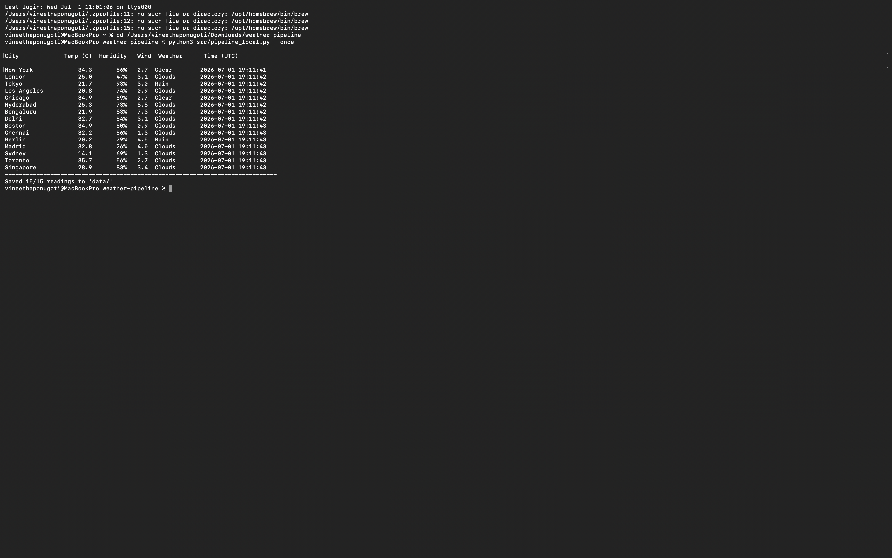

# Real-Time Weather Data Pipeline

A streaming data pipeline that collects live weather data for multiple cities from the OpenWeatherMap API, processes it, and stores it. It comes in two flavours:

- **Local mode** — runs entirely on your machine, no cloud account needed. Fetches weather, prints a live table, and saves each reading as JSON.
- **AWS mode** — the cloud deployment: a producer streams data to **AWS Kinesis**, and a **Lambda** function consumes the stream and writes each record to **S3**.

## Demo

Running the local pipeline fetches live weather for 15 cities, prints a formatted table, and saves each reading as a JSON file:



## Architecture

```
                         ┌─────────────────────────┐
                         │   OpenWeatherMap API     │
                         └────────────┬─────────────┘
                                      │  (fetch weather per city)
                     ┌────────────────┴────────────────┐
                     │                                  │
              LOCAL MODE                           AWS MODE
                     │                                  │
        ┌────────────▼───────────┐        ┌─────────────▼────────────┐
        │  pipeline_local.py     │        │  kinesis_producer.py     │
        │  - print live table    │        │  - put_record → Kinesis  │
        │  - save JSON to disk    │        └─────────────┬────────────┘
        └────────────────────────┘                      │
                                                ┌────────▼─────────┐
                                                │  AWS Kinesis     │
                                                │  Data Stream     │
                                                └────────┬─────────┘
                                                         │ (trigger)
                                                ┌────────▼─────────┐
                                                │  Lambda consumer │
                                                │  → write to S3   │
                                                └────────┬─────────┘
                                                         │
                                                ┌────────▼─────────┐
                                                │   Amazon S3      │
                                                └──────────────────┘
```

## Project structure

```
weather-pipeline/
├── src/
│   ├── config.py           # settings + env vars (shared)
│   ├── weather.py          # OpenWeatherMap fetch + retry (shared)
│   └── pipeline_local.py   # local mode: table + JSON, no AWS
├── aws/
│   ├── kinesis_producer.py # streams weather to Kinesis
│   └── lambda_consumer.py  # Lambda: Kinesis → S3
├── data/                   # local JSON output (gitignored)
├── setup.env.example       # template for your secrets
├── requirements.txt
└── README.md
```

## Setup

```bash
git clone https://github.com/vineethaponugoti7-cpu/weather-pipeline.git
cd weather-pipeline
pip install -r requirements.txt
```

Then set up your API key:

```bash
cp setup.env.example setup.env
```

Open `setup.env` and add your free OpenWeatherMap API key (get one at
https://openweathermap.org/api). **`setup.env` is gitignored — never commit it.**

## Running (local mode — no AWS needed)

Single pass over all cities:

```bash
python src/pipeline_local.py --once
```

Continuous polling (every 10 seconds by default):

```bash
python src/pipeline_local.py
```

Each reading is printed to the console and saved as a JSON file in `data/`.

## Running (AWS mode)

The cloud version requires an AWS account with a Kinesis stream and an S3 bucket.

1. Configure AWS credentials (`aws configure`).
2. Create a Kinesis stream and set `KINESIS_STREAM` / `AWS_REGION` in `setup.env`.
3. Start the producer:
   ```bash
   python aws/kinesis_producer.py
   ```
4. Deploy `aws/lambda_consumer.py` as a Lambda function, triggered by the Kinesis
   stream, with an `S3_BUCKET` environment variable and an IAM role permitting
   `kinesis:GetRecords` and `s3:PutObject`.

## Data format

Each weather reading is stored as JSON:

```json
{
  "city": "London",
  "temp": 14.2,
  "humidity": 72,
  "wind_speed": 3.6,
  "weather": "Clouds",
  "timestamp": "2025-08-01T12:00:00+00:00"
}
```

## How it works

- **Fetching** (`weather.py`) calls the OpenWeatherMap API per city, retries up to
  three times on failure, and extracts the fields of interest into a clean record.
- **Local mode** (`pipeline_local.py`) loops over the cities, prints a formatted
  table, and writes each record to a JSON file — mirroring what the cloud version
  stores in S3.
- **AWS mode** streams records into Kinesis (`kinesis_producer.py`); the Lambda
  consumer (`lambda_consumer.py`) is triggered by the stream and writes each record
  to S3.

## Security note

No secrets are committed to this repository. The API key and AWS details live in
`setup.env`, which is gitignored; `setup.env.example` shows the required variables
with placeholder values.

## Tech stack

Python, OpenWeatherMap API, AWS (Kinesis, Lambda, S3), boto3, requests.

## Limitations & future work

- Local mode stores flat JSON files; a database (or partitioned S3 by date) would
  scale better for querying.
- Possible extensions: a dashboard over the collected data, alerting on extreme
  weather, and scheduled runs via cron or AWS EventBridge.
